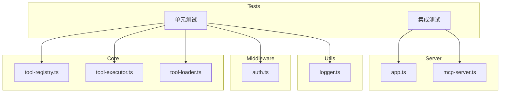

## 产品概述

为 MCP Server 项目添加完整的单元测试和集成测试覆盖，确保核心模块、中间件和服务器组件的代码质量和稳定性。

## 核心功能

- ToolRegistry 类测试：覆盖工具注册、注销、查询、健康检查等功能
- ToolExecutor 类测试：覆盖方法执行、参数验证、超时处理、错误处理
- ToolLoader 类测试：覆盖动态加载工具、加载失败处理
- authMiddleware 测试：覆盖认证逻辑、路径跳过、Token 验证
- Express 应用测试：覆盖路由端点、健康检查、工具列表
- createMcpServerForTool 测试：覆盖 MCP Server 创建和方法注册
- logger 工具测试：覆盖各级别日志输出

## 技术栈

- 测试框架：Vitest 2.1.0
- 语言：TypeScript 5.6.0
- 断言库：Vitest 内置
- HTTP 测试：supertest（需新增依赖）
- Mock 工具：Vitest vi.mock/vi.spyOn

## 技术架构

### 系统架构



### 模块划分

- **Core 测试模块**：针对 tool-registry、tool-executor、tool-loader 的单元测试
- **Middleware 测试模块**：针对 authMiddleware 的单元测试
- **Server 测试模块**：针对 Express 应用和 MCP Server 的集成测试
- **Utils 测试模块**：针对 logger 的单元测试

### 数据流

测试执行流程：Vitest 加载测试文件 → beforeAll/beforeEach 初始化 → 执行测试用例 → 验证断言 → afterEach/afterAll 清理

## 实现细节

### 核心目录结构

```
src/
├── core/
│   ├── tool-registry.ts
│   ├── tool-registry.test.ts      # 新增
│   ├── tool-executor.ts
│   ├── tool-executor.test.ts      # 新增
│   ├── tool-loader.ts
│   └── tool-loader.test.ts        # 新增
├── middleware/
│   ├── auth.ts
│   └── auth.test.ts               # 新增
├── server/
│   ├── app.ts
│   ├── app.test.ts                # 新增
│   ├── mcp-server.ts
│   └── mcp-server.test.ts         # 新增
└── utils/
    ├── logger.ts
    └── logger.test.ts             # 新增
```

### 关键代码结构

**ToolRegistry 测试结构**：覆盖工具注册、注销、查询、健康检查等核心功能的测试用例。

```typescript
// tool-registry.test.ts 测试结构
describe('ToolRegistry', () => {
  describe('register', () => {
    it('should register a tool successfully');
    it('should call initialize if provided');
    it('should replace existing tool with warning');
    it('should set health status to false on init failure');
  });
  describe('unregister', () => {
    it('should remove registered tool');
    it('should return false for non-existent tool');
  });
  describe('getTool/getAllTools', () => { });
  describe('getHealthyTools', () => { });
  describe('getToolStatus/getAllToolStatus', () => { });
  describe('performHealthCheck', () => { });
});
```

**ToolExecutor 测试结构**：覆盖方法执行、参数验证、超时处理和错误处理。

```typescript
// tool-executor.test.ts 测试结构
describe('ToolExecutor', () => {
  describe('execute', () => {
    it('should execute tool method successfully');
    it('should return error for non-existent tool');
    it('should return error for non-existent method');
    it('should validate parameters with Zod');
    it('should handle timeout');
    it('should handle execution errors');
  });
  describe('isCriticalError', () => {
    it('should identify ECONNREFUSED as critical');
    it('should not treat timeout as critical');
  });
});
```

**authMiddleware 测试结构**：覆盖认证逻辑、路径跳过和 Token 验证。

```typescript
// auth.test.ts 测试结构
describe('authMiddleware', () => {
  it('should skip auth for /health');
  it('should skip auth for /');
  it('should skip auth when AUTHORIZATION_KEY not set');
  it('should return 401 for missing Authorization header');
  it('should return 401 for invalid format');
  it('should return 403 for invalid token');
  it('should call next() for valid token');
});
```

### 技术实现方案

**依赖安装**：需要安装 supertest 用于 HTTP 集成测试。

```
npm install -D supertest @types/supertest
```

**Mock 策略**：

1. logger 模块：使用 vi.mock 避免测试日志输出
2. toolRegistry 单例：每个测试前重置状态
3. 环境变量：使用 vi.stubEnv 模拟 AUTHORIZATION_KEY
4. Express 应用：使用 supertest 进行端点测试